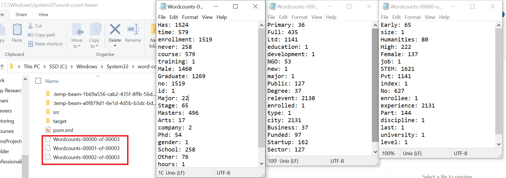

## Group 01 Team Members :
# Beam-Java
<table>
  <tr>
   <td align="center"><a href="https://github.com/blonbihani"> <b>Bihani Tamang</b></a> <a href="https://github.com/blonbihani" title="Code">💻</a></td>
  <td align="center"><a href="https://github.com/GuanMingChee"> <b>Guan Ming Lee</b></a> <a href="https://github.com/GuanMingChee" title="Code">💻</a></td>
  <td align="center"><a href="https://github.com/SpyridonKaperonis"> <b>Spyridon Kaperonis</b></a> <a href="https://github.com/SpyridonKaperonis" title="Code">💻</a></td>
  <td align="center"><a href="https://github.com/ChaseStaples"> <b>Chase Staples</b></a> <a href="https://github.com/ChaseStaples" title="Code">💻</a></td>
   <td align="center"><a href="https://github.com/soumyarao28"> <b>Soumya Chidambar Rao Waddankeri</b></a> <a href="https://github.com/soumyarao28" title="Code">💻</a></td>
  </tr>
</table>
  
## Chee
### Topics covered: [Demo Link](https://use.vg/uQBWKw)
- Installation
- simple word count
## Introduction 
- Beam is an open source, unified model that define and execute both batch and streaming data-parallel processing pipelines. 
- Beam decompose problems into many smaller bundles of data that can be processed independently and in parallel.
- Beam can be used for Extract, Transform, and Load (ETL) tasks and pure data integration.
## Installation Walkthrough
 
1) Download JDK version 8
 

 
 
2) Set environment variable
 

 
 
3) Download binary zip archive
 

 
 
4) Unzip the file, add path of bin directory of apache maven to PATH, check the version with `mvn -v`
 

 
 

## Basic Word Count
 
For Word count, we will need to create a Maven project with all the release/files specified for pipeline use. Then, add the dependency before running the pipeline.
 
1) run the code below with PowerShell

 
 
2) check the files and pipeline created

 
 
3) add dependency

 
 
4) run the word count

 
After this, you can do "ls counts*" to check the result or go to "word-count-beam" directory and click on they newly generated files.
 
The dataset in .csv files will be map the word to word count. Then, the key value pair will be reduced so that all duplicates will be removed and add to the word count. The whole process is using the dictionary concept in Python. 
 
 

 

## Soumya Chidambar Rao Waddankeri
### Topics covered: 
- I have been working on the <i>Minimal Word Count</i> for the covid vaccination dataset.[https://www.kaggle.com/gpreda/covid-world-vaccination-progress]
## Minimal Word Count
For Minimal Word count, we have created a Maven project with all the release/files specified for pipeline use. Then, add the dependency before running the pipeline and followed the steps mentioned above.

After this, you can do "ls wordcount*" to check the result or go to "word-count-beam" directory and click on they newly generated files.

The dataset in .csv files will be map the word to word count. Then, the key value pair will be reduced so that all duplicates will be removed and add to the word count. The whole process is using the dictionary concept in Java. 

 
 

## Chase Staples
### Topics Covered: 

I will be working on the follow topics for the Covid Dataset [https://www.kaggle.com/gpreda/covid-world-vaccination-progress]

## Reduced 

The word-count file will be <i>Reduced</i> to whatever parameters are set for that specific output of that dataset(Words, Starting with, ending with, Having "", and so on..)

## Bihani
### Topics covered:
I will be working on the following tasks on the project:

- Word Count (with a different dataset)

### Dataset:
I will be taking 'HR Analytics: Job change of Data Scientists' dataset which has variety of data about the employee. So, the program will help us count the number of times the words in the dataset are repeated.

 

1: Maven installed (Please scroll up to know how to install Maven)

2: Run the word count code:

3: Check the output 

The output will be directed into different files in the same directory that we're working on. Here, we have 3 output files for the Word Count program using the given dataset. 

## Spyridon Kaperonis

### Topic Covered: 

I will be working on the following dataset which is about Cryptocurrencies. [https://www.kaggle.com/philmohun/cryptocurrency-financial-data](https://www.kaggle.com/philmohun/cryptocurrency-financial-data)

### Max math operation

### References
- [Dataset](https://www.kaggle.com/arashnic/hr-analytics-job-change-of-data-scientists)
- [Beam](https://beam.apache.org/get-started/quickstart-java/)
- [Apache Maven](https://maven.apache.org/download.cgi)
- [Maven Installation Guide](https://maven.apache.org/install.html)
- [Direct Runner dependency](https://beam.apache.org/documentation/runners/direct/)

